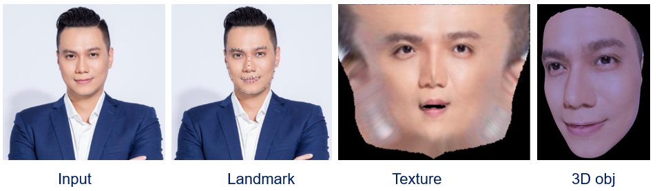
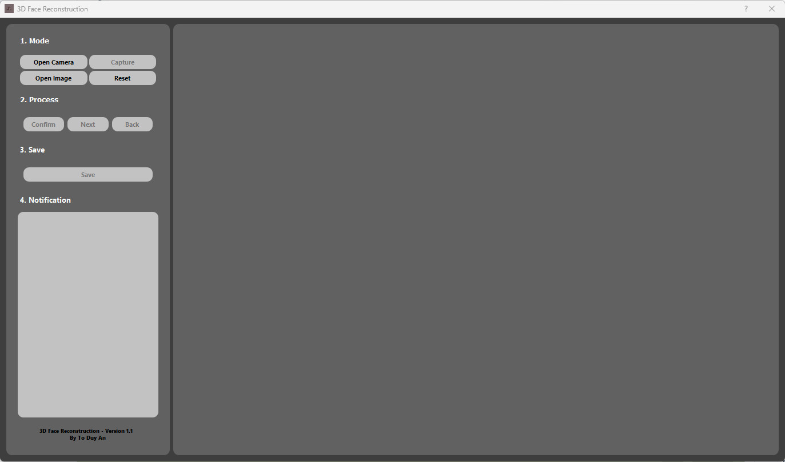

# Overview
This repository contains an application that aligns, visualizes the process of reconstructing 3D biometric facial data, using Facenet python library, 3DDFA_V2 source.

The goal of this implementation is to be simple, easy to use, only plug and play. This implementation is a work in progress -- new features are currently being implemented.

At the moment, you can easily:
 * Detect face / multi-face using Facenet
 * Build face landmark with 2 mode (Sparse/Dense) using TDDFA pre-trained model.
 * Generate 3D UV texture and save its on local directory 
 * Use image and webcam as input 

_Upcoming features_: In the next few days, you will be able to:
 * Use a better AI model for face detection
 * Select different pre-trained TDDFA AI models
 * Export settings for easy loading and reuse in the future

## Installation
`Step 1:` Create `3dface` conda environment with `python>=3.8`:
```
conda create -n 3dface python=3.8
```

`Step 2:` Clone this repo (this may take some time as it is a little big)
```
git clone https://github.com/stillxthahn/FITUS-PatternRecognition-FinalProject.git
cd FITUS-PatternRecognition-FinalProject
```

`Step 3:` Install requirements and other dependencies:
```
pip install -r requirements.txt
```

`Step 4:` Build the Sim3DR dependency:
```
cd Sim3DR
python setup.py build_ext --inplace
cd ..
```

## Quick start
Run example 
```
python example.py
```
The default input data is `./images/img1`, you can change your own input data by replacing line 17 of `main.py` ("images/img1.jpg").
Output is stored at `./outputs/<yyyymmdd_hhmmss>`, which includes face landmark, face's texture and 3D face's obj file.
<!-- <p align="center">
  
</p> -->

<!-- ## Useage
Run Gui version
```
python gui_main.py
```
Here's UI application
<p align="center">
  
</p> -->


